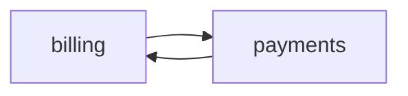

# architect — Incomplete design skill

## When to use

- A BRD exists

##When NOT to use

- Coding

## Execution contract (mandatory)

**Announce at start:** "Running **/architect** (incomplete)."

## Approval gate (mandatory)

Silence is **not** approval.

## Modules

- billing
- payments
- legacy



```
print("draft")

## API formatting

OpenAPI with an operationId, a JSON example, a security scheme, and an error model.

`GET /v1/invoices`

| Mode | Subskill |
| --- | --- |
| new |

## Done when

- A diagram exists
