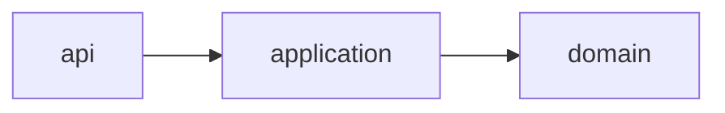

# Export service design

## Objectives

The objective is a daily export that operators can trust.

## Scope

The scope is the scheduled export described in the approved BRD. A PRD constraint limits the sheet to ticket keys.

## Components

The components are the API, the application service, and the domain model.

## Modules

- api (entry)
- application
- domain



Reject deadlocks and dependency cycles. Flag orphan modules. Measure coupling density.

## Integrations

The only external system is the ticket store, reached across a trust boundary.

## Data design

The sheet stores the ticket key and the link. Data classification is confidential, and residency stays in the approved region.

## Security

A threat model covers authentication, authorization, and secret handling.

## Non-functional requirements

Capacity is 5000 tickets. The SLO is 99.9% of runs, and latency stays under 15 minutes. The service can scale by adding a worker. Rollback restores the previous sheet. A failed run is a known failure mode.

## Risks

The main risk is a missed cutoff. The constraint is a single daily window.

## Tech stack

Postgres was chosen because the export is relational and the runtime is Python.

## API

The contract is OpenAPI. Each operation has an operationId, a JSON example, a security scheme, and an error model.

`GET /v1/exports`

```json
{"ticketKey": "ABC-1"}
```
