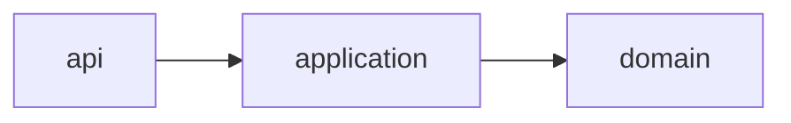

# architect — Solution architecture and design

Writes the design package and hands it to /build.

## When to use

- An approved BRD or PRD is available
- The user asks for solution architecture

## When NOT to use

- Requirements are still open
- The user wants implementation code

## Execution contract (mandatory)

**Announce at start:** "Running **/architect** (solution architecture and design)."

### Progress checklist

```
Task Progress:
- [ ] Design DRAFT presented
- [ ] Explicit approval received
- [ ] Finals written (post-approval only)
```

### Stop conditions

- Never write finals without explicit approval

### Mini example

```
/architect
@brd/BRD.md
Draft only — wait for approval before writing signoff/.
```

## Approval gate (mandatory)

Silence is **not** approval. Ask for explicit approval before writing finals.

## Modules

- api (entry)
- application
- domain



Reject deadlocks and dependency cycles. Flag orphan modules. Measure coupling density.

## Feasibility and scale

Record constraints, failure modes, rollback, and capacity. Set an SLO and a latency target so the design can scale.

## Security

Run a threat model. State authentication, authorization, and secret handling. Draw the trust boundary, name external systems, and record data classification and residency.

## Tech stack

Name the tech stack, including the runtime and the database, and why it was chosen.

## Business alignment

Trace each objective and the scope to the approved BRD or PRD.

## API formatting

Describe the surface with OpenAPI. Every operation uses an operationId, a JSON example, a security scheme, and an error model.

`GET /v1/exports`

| Mode | Subskill |
| --- | --- |
| new | complete |

## Done when

- Design written under signoff/
- Evidence attached
- Hand-off to /build
